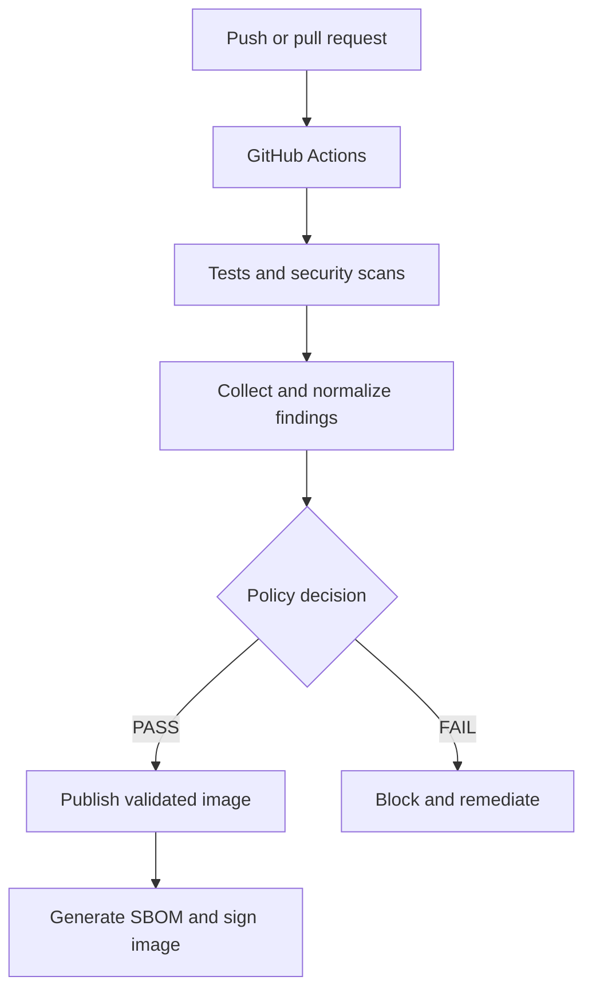

# Pipeline Architecture

## Purpose

This project applies automated security controls throughout the build process of a Dockerized Flask API.

## DevSecOps Flow

## Security Controls

| Stage | Control |
|---|---|
| Source code | Semgrep SAST |
| Dependencies | pip-audit SCA |
| Git history | Gitleaks |
| Configuration | Trivy Config |
| Container image | Trivy Image |
| Running application | OWASP ZAP DAST |
| Supply chain | Syft SBOM and Cosign signature |
| Risk decision | Policy-based security gates |

## Trust Boundaries

1. Developer workstation to GitHub repository.
2. GitHub repository to GitHub Actions runner.
3. Runner to the temporary application container.
4. Validated workflow to GitHub Container Registry.